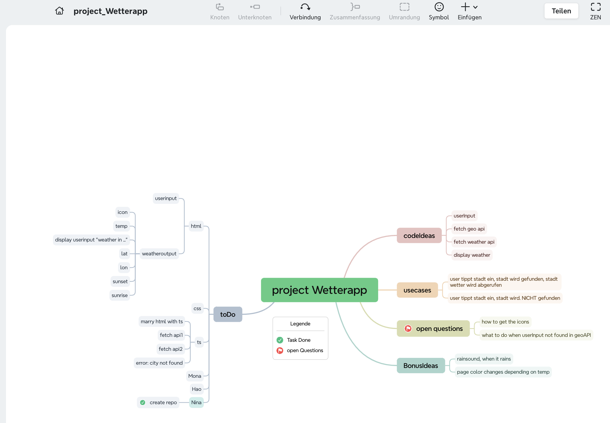
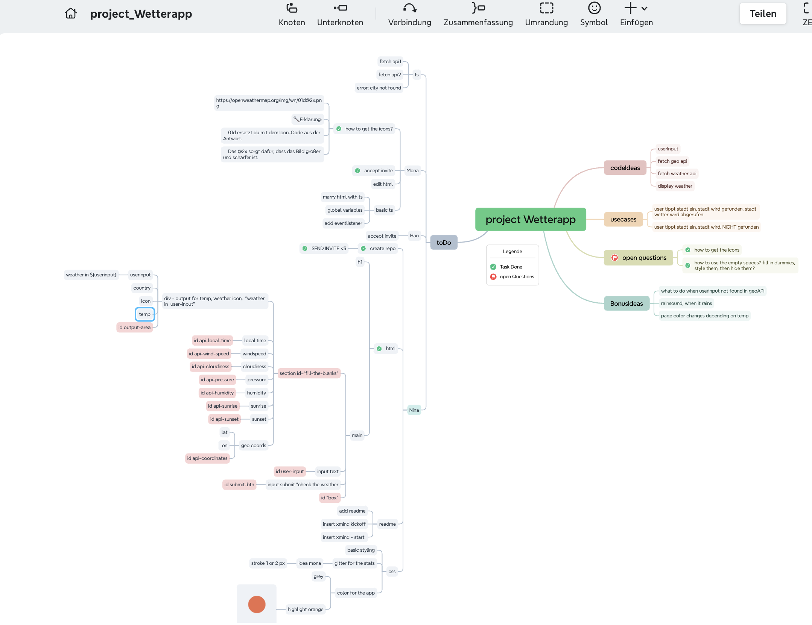

# Project_WeatherApp

lovely TeamProject to practice APIs.
=> Create a WeatherApp with OpenWeather API.
Team Mona, Hao, Nina

[Instructions](https://supercode.notion.site/Projekt-Open-Weather-d6e83a2a0ccc48fe966db8180eaa3cf4)

[API: OpenWeather](https://openweathermap.org/)

Xmind overview 15 Min in

Xmind overview - first merge, prepared for next run,
